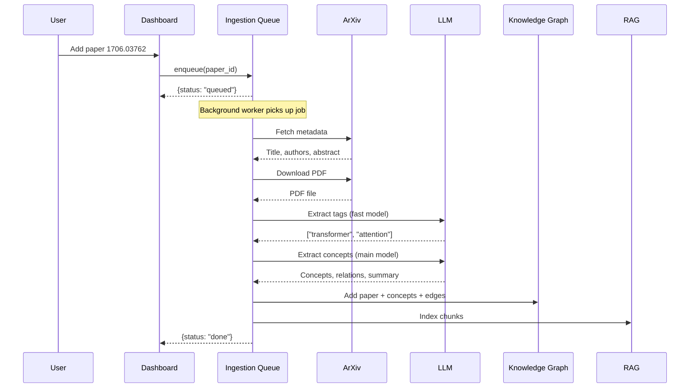

# Building a Local Research Knowledge Graph: Hive Research GPU

**Author**: Data Scientist, Swift — Financial Services  
**Topic**: Knowledge Graphs, Local AI, Research Automation  
**Stack**: Python, Ollama, D3.js, SQLite, FAISS

---

## The Problem

As a data scientist researching knowledge graphs at Swift — Financial Services, I faced a growing challenge: keeping up with the flood of academic papers across AI, machine learning, cryptography, and distributed systems. Every week, hundreds of new papers drop on arXiv. Reading, understanding, and connecting ideas across papers is a full-time job in itself.

Existing tools were either:
- **Cloud-dependent** (sent your data to third-party APIs — a no-go for financial services)
- **Single-purpose** (just search, just reference management, no analysis)
- **Closed ecosystems** (no ability to customize the pipeline)

We needed something that could run entirely on-premises, respect data sovereignty requirements, and actually *understand* what papers are about — not just store metadata.

---

## The Vision

> A local-first research assistant that ingests papers, builds a knowledge graph of concepts, lets you ask questions in natural language, and surfaces connections you wouldn't find by reading alone — all running on consumer GPU hardware.

```
┌─────────────────────────────────────────────────────────────┐
│                     Interface Layer                          │
│  ┌────────────────────┐  ┌───────────────────────────────┐  │
│  │   CLI (argparse)   │  │  Web Dashboard (SPA)          │  │
│  │  search/add/query   │  │  Force-directed graph viz    │  │
│  │  import/export/etc  │  │  RAG Chat, Browse, Pool     │  │
│  └────────┬───────────┘  └──────────────┬────────────────┘  │
└───────────┼──────────────────────────────┼──────────────────┘
            │                              │
┌───────────┴──────────────────────────────┴──────────────────┐
│                   Orchestration Layer                        │
│  ┌──────────────────────────────────────────────────────┐   │
│  │                    Organizer                          │   │
│  │  add_paper()  search()  query_rag()  similarity()    │   │
│  │  export()  collections()  refresh()                  │   │
│  └───┬─────┬──────┬────────┬────────┬────────┬─────────┘   │
└──────┼─────┼──────┼────────┼────────┼────────┼─────────────┘
       │     │      │        │        │        │
┌──────┴┐ ┌──┴──┐ ┌─┴───┐ ┌──┴───┐ ┌──┴───┐ ┌─┴────┐
│Pipeline│ │  KG │ │ RAG │ │ Pool │ │ Web  │ │LLM   │
│process │ │graph│ │search│ │topic │ │Ingest│ │Inter.│
│_paper()│ │     │ │query │ │observ│ │      │ │      │
└───┬────┘ └─────┘ └──┬───┘ └──────┘ └──────┘ └──┬───┘
    │                  │                          │
┌───┴──────────────────┴──────────────────────────┴───┐
│                  GPU Manager                         │
│  Ollama GPU 0 (port 11434)  Ollama GPU 1 (11435)    │
│  nvidia-smi monitoring, round-robin GPU assignment   │
└──────────────────────────────────────────────────────┘
```

---

## Design Principles

### 1. Local-First by Default

Everything runs on your hardware. No data ever leaves your network unless you explicitly search arXiv (which is public data anyway).

- **Ollama** serves LLMs locally (llama3.2 for fast tagging, qwen3.6 for deep analysis)
- **nomic-embed-text** generates embeddings without sending text to any API
- **Dual GPU parallelism** — two Ollama instances, one per GPU, for concurrent inference
- **All storage** — graph, embeddings, notes, pool — lives on local disk

### 2. Knowledge Graphs as the Core Data Model

Instead of a flat list of papers, every paper becomes a *node* in a typed knowledge graph:

```
[Paper:1706.03762] ──introduces──▶ [Concept:Transformer]
       │                                  │
       │                                  │
       ▼                                  ▼
[Concept:Attention] ◀──uses──── [Paper:2106.09685]
```

Concepts are deduplicated via fuzzy Jaccard matching, so "Transformer architecture" and "Transformer model" map to the same node.

### 3. Hybrid Search (Because Neither Vector Nor Keyword Is Enough)

Early versions used pure cosine similarity on embeddings. It found semantically related papers but missed exact keyword matches. BM25 keyword search found exact matches but missed conceptual connections.

The solution: **Reciprocal Rank Fusion (RRF)**

```
score(d) = 1/(60 + rank_vector(d)) + 1/(60 + rank_keyword(d))
```

Result: hybrid search that captures both semantic meaning and keyword precision.

```
[RAG Chat Interface - Screenshot]
The chat panel showing a RAG query with cited sources:
"Q: What methods are used for graph classification?"
"A: Graph neural networks achieve state-of-the-art... [1][2]"
```

### 4. Optional FAISS for Scalability

For small collections (<10K chunks), numpy brute-force cosine similarity is fast enough. As the knowledge base grows, FAISS IndexFlatIP kicks in automatically when installed:

```python
pip install faiss-cpu  # drops query latency from O(N) to O(log N) for large indices
```

---

## The Ingestion Pipeline

When a user adds a paper, here's what happens in the background:



Each step logs a status update:
```
21:30:15 [INFO] 1706.03762:fetching — Fetching metadata from arXiv
21:30:17 [INFO] 1706.03762:downloading — Downloading PDF
21:30:35 [INFO] 1706.03762:analyzing — LLM concept extraction
21:30:38 [INFO] 1706.03762:done — Added: 5 concepts, 3 tags
```

---

## The Dashboard

The web dashboard is a single-page application served by the Python HTTP server. It communicates via a REST API — no frameworks, no build step, just vanilla JavaScript and D3.js.

```
[Dashboard Graph View - Screenshot]
Force-directed knowledge graph showing paper nodes (blue),
concept nodes (purple), and citation edges (green).
```

### Core Views

| View | What it does |
|------|-------------|
| **Graph** | Interactive D3 force-directed graph. Drag, pan, zoom. Click any node for details |
| **Browse** | Searchable paper list with file explorer. Preview vault notes, figures, lineage |
| **Similarity** | Pairwise paper comparison with configurable algorithms |
| **Chat** | RAG question-answering with vector, keyword, or hybrid search |
| **Pool** | arXiv topic monitoring with insight cards and similarity graph |
| **Collections** | User-defined paper sets and saved searches |

```
[Research Pool Panel - Screenshot]
Split view showing topic insight cards (left) with observed/imported
counts and conversion bars, and pool similarity graph (right).
```

### Research Pool

The pool automatically monitors 8 arXiv topics on a 12-hour cycle:

| Topic | Query |
|-------|-------|
| Knowledge graphs | `knowledge graph embedding` |
| Federated learning | `federated learning` |
| AI security | `AI security adversarial machine learning` |
| LLM security | `large language model security` |
| Graph neural networks | `graph neural network` |
| Vision-language models | `vision language model` |

Each refresh fetches up to **100 papers per topic** — 800 papers observed per cycle — saved to a local SQLite database with pre-computed similarity cache.

---

## Data Flow: Paper Ingestion

The ingestion pipeline processes papers through 8 stages:


### Stage Details

1. **arXiv Fetch** — REST API → Paper metadata (title, authors, abstract, categories)
2. **PDF Download** — HTTP GET from `arxiv.org/pdf/{id}`
3. **Text Extraction** — PyMuPDF (fitz) — plain text with section detection
4. **Tag Extraction** — Fast LLM (llama3.2:3b) — generates 3-5 keywords
5. **Concept Extraction** — Main LLM (qwen3.6:35b) — extracts concepts, relations, summary
6. **Graph Population** — Adds paper node + concept nodes + typed edges with fuzzy dedup
7. **Citation Lineage** — Scans references for arXiv IDs, fetches cited papers
8. **RAG Indexing** — Chunks text (512 words, 64 overlap), parallel GPU embedding, saves to numpy

---

## RAG Engine: Three Search Modes

```
[RAG Hybrid Search Results - Screenshot]
Showing the same question answered with vector, keyword, and hybrid modes.
Hybrid mode combines the best of both.
```

| Mode | Method | Best For |
|------|--------|----------|
| **Vector** | Cosine similarity on embeddings | Semantic concepts, paraphrased queries |
| **Keyword** | BM25 (k1=1.5, b=0.75) | Exact terms, author names, specific methods |
| **Hybrid** | RRF fusion of both | General research questions |

```python
from hive_research import HiveClient

client = HiveClient("http://localhost:7777")

# Hybrid mode (default, recommended)
result = client.query(
    "What architectures are used for graph classification?",
    mode="hybrid"
)
print(result["answer"])
# → "Graph neural networks (GNNs) achieve state-of-the-art..."
```

---

## Local AI Architecture

```
┌──────────────────────────────────────────────────┐
│                   Server (port 7777)              │
│  ┌──────────┐  ┌──────────┐  ┌────────────────┐  │
│  │  HTTP    │  │  RAG     │  │  Knowledge     │  │
│  │  Server  │──│  Engine  │──│  Graph         │  │
│  └──────────┘  └────┬─────┘  └───────┬────────┘  │
│                     │                 │           │
│              ┌──────▼──────┐   ┌──────▼──────┐   │
│              │  Ollama GPU 0│  │  Ollama GPU 1│   │
│              │  qwen3.6    │  │  llama3.2    │   │
│              │  nomic-embed│  │              │   │
│              └─────────────┘  └─────────────┘   │
└──────────────────────────────────────────────────┘
```

No cloud, no API keys, no data leaving your machine. Two NVIDIA RTX 5080 GPUs running Ollama instances — one for the large analysis model (qwen3.6:35b), one for fast tagging (llama3.2:3b) and embeddings.

---

## What I Learned

### 1. Knowledge Graphs Beat Flat Lists

A flat list of papers is just a bibliography. A knowledge graph with typed nodes (Paper, Concept, Tag, Web Resource) and typed edges (introduces, uses, cites, related_to) lets you:

- Find which papers introduced a concept vs. used it
- Trace citation influence across subfields
- Discover concept clusters you didn't know existed

### 2. Local LLMs Are Production-Ready

When I started this project, I assumed we'd need GPT-4 or Claude. But Ollama-hosted models (llama3.2:3b, qwen3.6:35b) handle extraction tasks surprisingly well — and the latency/throughput of dual GPUs makes it practical for batch processing.

The key insight: **extraction is easier than generation**. Asking an LLM to extract structured JSON from a paper is a constrained task that small models handle reliably.

### 3. Hybrid Search Is Non-Negotiable for Research

Vector search alone misses exact method names ("GraphSAGE", "GAT"). BM25 alone misses conceptual connections ("message passing" ≈ "neighborhood aggregation"). The RRF fusion of both approaches captures the strengths of each.

### 4. Async Queues Make the UX Smooth

Paper ingestion takes 2-5 minutes per paper (download + LLM extraction + embedding). Without a queue, the user stares at a loading spinner. With the ingestion queue, they get instant feedback:

> "1706.03762:queued — Waiting in queue"  
> "1706.03762:fetching — Fetching metadata from arXiv"  
> ...  
> "1706.03762:done — Added: 5 concepts, 3 tags"

Each status update appears in the activity log in real-time.

---

## The Stack

| Component | Technology | Why |
|-----------|-----------|-----|
| Backend | Python 3.12+ | Rich ecosystem, easy integration |
| LLMs | Ollama (llama3.2, qwen3.6, nomic-embed-text) | Local, private, GPU-accelerated |
| Knowledge Graph | HiveGraph (hive-datatype) | Typed nodes/edges, JSON persistence |
| Vector Search | FAISS (optional) / numpy | Fast approximate nearest neighbor |
| Keyword Search | BM25 (custom) | Exact term matching |
| Frontend | Vanilla JS + D3.js | No build step, no framework overhead |
| Storage | SQLite + JSON + numpy | Zero infrastructure, simple backups |
| GPU | NVIDIA RTX 5080 (dual) | Parallel LLM inference + embedding |

---

## Getting Started

```bash
# Install
pip install hive-research-gpu

# Start the server
python -m hive_research serve

# Open http://localhost:7777/hive
```

Or use the Python client directly:

```python
from hive_research import HiveClient

client = HiveClient("http://localhost:7777")

# Check system status
stats = client.stats()
print(f"Papers: {stats['papers']}")

# Add a paper
client.add_paper("1706.03762")

# Ask questions with hybrid search
result = client.query(
    "What are the key contributions of the transformer?",
    mode="hybrid"
)
```

---

## The Code

Open source at: [github.com/your-org/hive-research-gpu](https://github.com/your-org/hive-research-gpu)  
Built with Python, Ollama, D3.js, and a lot of curiosity.

---

*Views are my own and not necessarily those of Swift — Financial Services.*

*#KnowledgeGraph #LocalAI #RAG #GraphDatabase #MachineLearning #ResearchTools #Python #Ollama #D3js*
