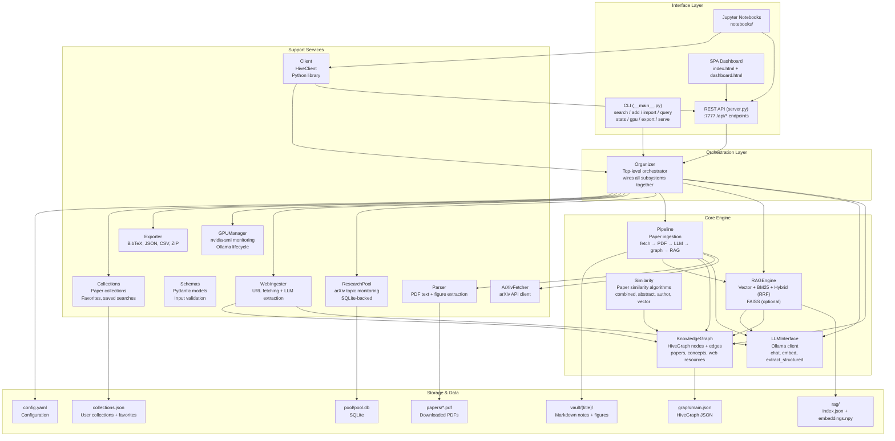
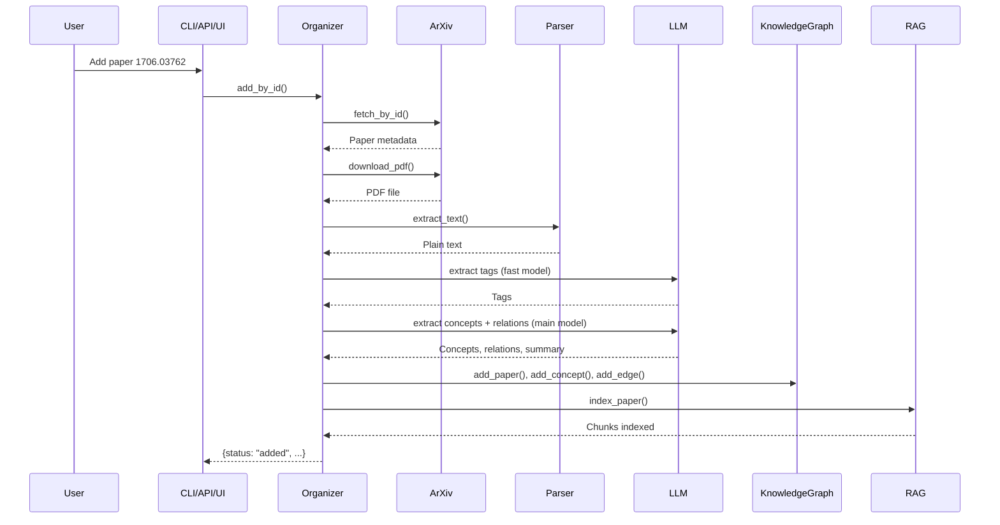
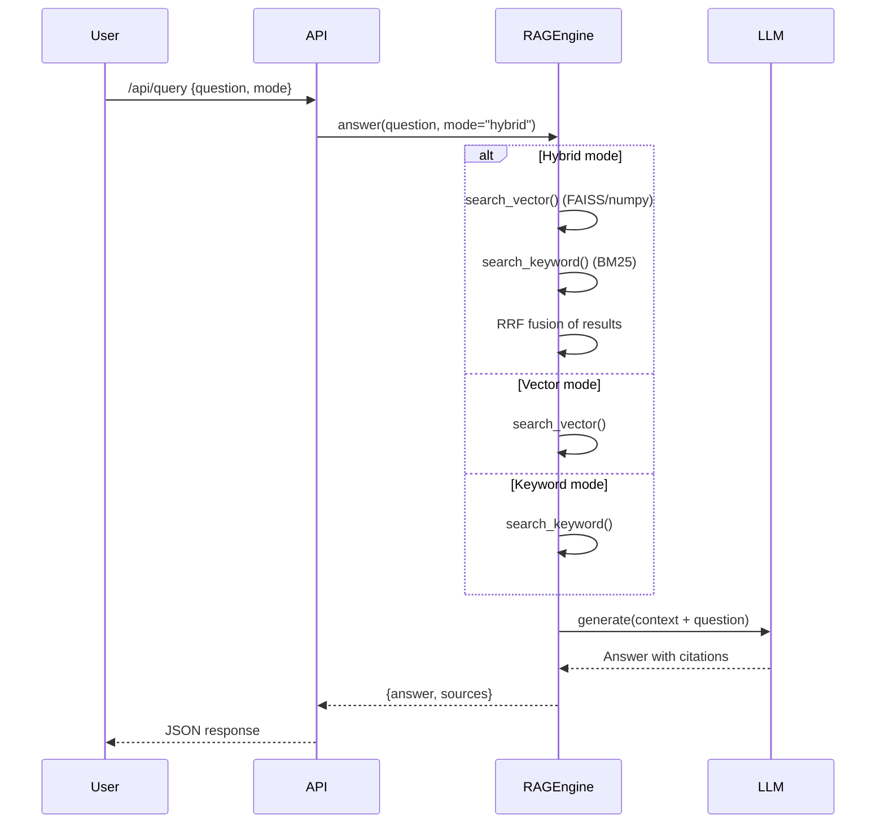

# Hive Research GPU — Architecture



## Data Flow: Paper Ingestion



## Data Flow: RAG Query



## Module Dependency Graph

```mermaid
graph LR
    __main__ --> organizer
    server --> organizer
    client --> organizer
    client --> server

    organizer --> config
    organizer --> graph
    organizer --> llm
    organizer --> pipeline
    organizer --> rag
    organizer --> pool
    organizer --> web_ingest
    organizer --> exporter
    organizer --> collections

    pipeline --> arxiv_fetcher
    pipeline --> parser
    pipeline --> llm
    pipeline --> graph

    rag --> config
    rag --> llm
    rag --> graph

    similarity --> graph

    web_ingest --> llm
    web_ingest --> graph

    llm --> config
    llm --> gpu

    gpu --> config
    pool --> config
    exporter --> config
    exporter --> graph
    collections --> graph

    schemas --> server

    style organizer fill:#60a5fa,color:#000
    style server fill:#34d399,color:#000
    style client fill:#fbbf24,color:#000
```

## Data Storage Layout

```
data/
├── papers/           # Downloaded PDFs (arXiv ID + .pdf)
│   ├── 1706.03762.pdf
│   └── 1706.03762.txt          # Cached extracted text (sidecar)
├── graph/
│   └── main.json               # HiveGraph JSON (nodes + edges)
├── vault/                       # Markdown notes
│   └── attention_is_all_you_need/
│       ├── 00_notes.md          # Paper notes + YAML frontmatter
│       ├── 01-experiment.md     # Per-experiment notes
│       └── figures/             # Extracted figures
│           ├── figure_p01_01.png
│           └── ...
├── rag/
│   ├── index.json              # Chunk index (text, source, chunk_idx)
│   └── embeddings.npy          # Dense embedding matrix (numpy)
├── pool/
│   └── pool.db                 # Research pool SQLite database
├── backups/                    # ZIP backups (created via export)
│   └── hive_backup_20250123.zip
└── collections.json            # Paper collections + favorites
```
