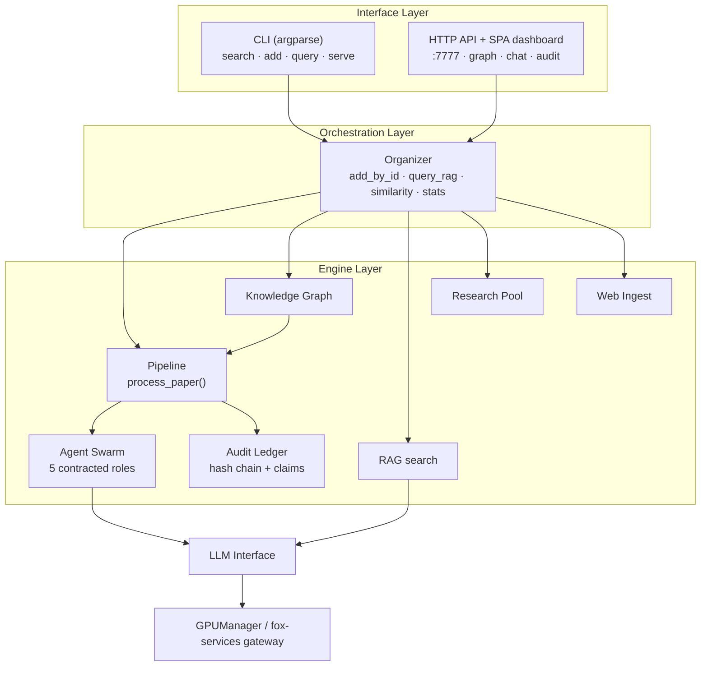
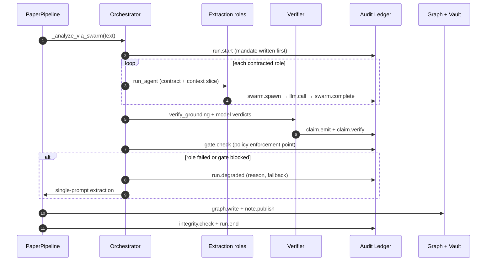

# Architecture

## Overview

Hive Research GPU is organized as a layered system with three tiers:

1. **Interface Layer** — CLI (`__main__.py`) and REST API + SPA dashboard (`server.py`)
2. **Orchestration Layer** — `Organizer` ties together all subsystems
3. **Engine Layer** — Individual modules for arXiv, LLM, graph, RAG, pool, similarity


```mermaid
flowchart TB
    subgraph Interface["Interface Layer"]
        CLI["CLI (argparse)<br/>search · add · query · serve"]
        UI["HTTP API + SPA dashboard<br/>:7777 · graph · chat · audit"]
    end

    subgraph Orchestration["Orchestration Layer"]
        ORG["Organizer<br/>add_by_id · query_rag · similarity · stats"]
    end

    subgraph Engines["Engine Layer"]
        PIPE["Pipeline<br/>process_paper()"]
        SWARM["Agent Swarm<br/>5 contracted roles"]
        KG["Knowledge Graph"]
        RAG["RAG search"]
        POOL["Research Pool"]
        WEB["Web Ingest"]
        LEDGER["Audit Ledger<br/>hash chain + claims"]
    end

    LLM["LLM Interface"]
    GPU["GPUManager / fox-services gateway"]

    CLI --> ORG
    UI --> ORG
    ORG --> PIPE
    ORG --> KG
    ORG --> RAG
    ORG --> POOL
    ORG --> WEB
    PIPE --> SWARM
    SWARM --> LLM
    PIPE --> LEDGER
    RAG --> LLM
    KG --> PIPE
    LLM --> GPU
```

## Data Flow: Paper Ingestion

```
arXiv ID/URL
    │
    ▼
1. arxiv_fetcher.fetch_by_id()
    • arXiv REST API → PaperInfo (title, authors, abstract, categories)
    │
    ▼
2. download_pdf()
    • HTTP GET https://arxiv.org/pdf/{id}.pdf → papers/{id}.pdf
    │
    ▼
3. parser.extract_text()
    • PyMuPDF → plain text
    │
    ▼
4. agents.run_extraction_swarm()
    • Contracted roles run in sequence: tag-classifier, contribution-extractor,
      experiment-analyst, concept-extractor, lineage-tracer
    • Each role gets a bounded, role-weighted slice of the paper
    • A deterministic grounding check + model verifier score every number
    • Every role, model call and claim is written to the audit ledger
    • Single-prompt extraction remains as a recorded fallback (run.degraded)
    │
    ▼
5. Knowledge Graph population
    • add_paper() → Node(type=PAPER)
    • add_concept() for each tag and extracted concept
    • add_edge() for relations, citations, concept links
    • Deduplication via fuzzy Jaccard matching (threshold 0.85)
    │
    ▼
6. Citation Lineage
    • Extract arXiv IDs from PDF references
    • Fetch metadata for each cited paper
    • Add as nodes with "cites" edges
    │
    ▼
7. Vault Notes
    • Markdown file with YAML frontmatter
    • Summary, notes, experiments, results, figures, concepts
    • Per-experiment markdown files
    │
    ▼
8. RAG Indexing
    • Chunk text (512 words, 64 overlap)
    • Parallel embedding across GPUs
    • Save to index.json + embeddings.npy
```

## Data Storage

| Location | Contents |
|----------|----------|
| `data/papers/{arxiv_id}.pdf` | Downloaded PDFs |
| `data/graph/main.json` | Knowledge graph (HiveGraph JSON) |
| `data/vault/{safe_title}/00_notes.md` | Paper notes with frontmatter |
| `data/vault/{safe_title}/{experiment}-00-experiment.md` | Per-experiment notes |
| `data/vault/{safe_title}/figures/` | Extracted figures |
| `data/rag/index.json` | RAG chunk index |
| `data/rag/embeddings.npy` | Dense embeddings (numpy) |
| `data/pool/pool.db` | Research pool SQLite database |
| `data/ledger.sqlite3` | Hash-chained audit ledger (runs, events, claims) |

## Audit Ledger and Agent Swarm

Ingest is a contracted swarm whose decisions are recorded on a tamper-evident
hash chain, so a note can be traced back to the roles, models and checks that
produced it.

- **Roles and contracts** (`swarm.py`) — every role declares its required
  inputs, expected outputs and failure behaviour. A role that cannot produce a
  declared field leaves an explicit marker, not a silent gap.
- **Hash chain** (`ledger.py`, `ledger_models.py`) — each event hashes its core
  fields together with the previous event's hash. `verify_chain()` detects
  edits, deletions, reordering and head substitution. `data/ledger.sqlite3` is
  the only new storage; it is stdlib `sqlite3`, matching `pool.py`.
- **Claims** — extracted numbers are content-addressed and checked against the
  source, first by substring and then by the verifier model. Every claim emits
  `claim.emit` and `claim.verify` events.
- **Assurance** (`assurance_ledger.py`) — derives class coverage, absence alerts
  and an integrity report from the chain. A blocked gate does not delete the
  evidence; it flags the run.
- **Degradation** — if the swarm cannot finish, the pipeline records
  `run.degraded` *before* falling back to the single-prompt extractor, so a
  fallback note is never mistaken for a clean swarm run.
- **Surfaces** — `/api/ledger/*` and `/api/swarm/*` expose runs, chains,
  topology, health and resume state; the dashboard's Audit panel reads them.

See [Design](design.md) for the full diagram set — UML component and class
models, activity and interaction diagrams, run/claim state machines, trust
boundaries, and deployment.


```mermaid
sequenceDiagram
    autonumber
    participant P as PaperPipeline
    participant O as Orchestrator
    participant A as Extraction roles
    participant V as Verifier
    participant L as Audit Ledger
    participant G as Graph + Vault

    P->>O: _analyze_via_swarm(text)
    O->>L: run.start (mandate written first)
    loop each contracted role
        O->>A: run_agent (contract + context slice)
        A->>L: swarm.spawn → llm.call → swarm.complete
    end
    O->>V: verify_grounding + model verdicts
    V->>L: claim.emit + claim.verify
    O->>L: gate.check (policy enforcement point)
    alt role failed or gate blocked
        O->>L: run.degraded (reason, fallback)
        O->>P: single-prompt extraction
    end
    P->>G: graph.write + note.publish
    P->>L: integrity.check + run.end
```

## Concurrency Model

- **GPU assignment** — Round-robin across available GPUs for LLM and embedding tasks
- **Parallel paper processing** — `threading.Thread` pool, one thread per paper, one GPU per thread
- **Embedding parallelism** — Chunk embeddings computed concurrently across GPUs
- **Server** — Single-threaded stdlib `HTTPServer`; background threads for pool refresh
