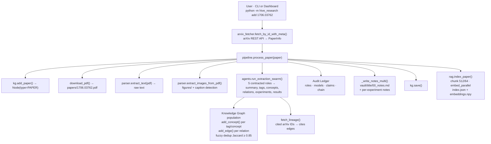
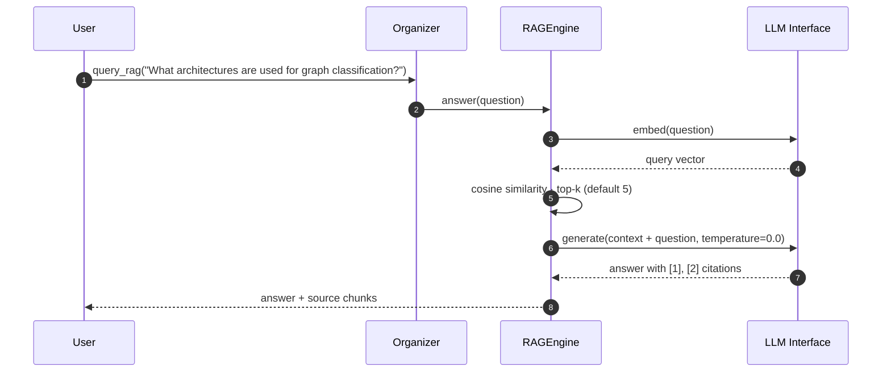

# Data Flow

## Paper Ingestion Pipeline

The following diagram traces a single paper through the system:



## Query Flow



## Research Pool Flow

```
Background thread (every 12 hours)
    │
    └─ pool._bg_refresh()
           │
           ├─ For each topic:
           │      search_arxiv(topic.query, max_results=10)
           │      │
           │      ├─ For each result:
           │      │      ├─ If existing: update last_seen, append topic
           │      │      └─ If new: INSERT with first_seen=now
           │      │
           │      └─ Cache result in SQLite with TTL
           │
           └─ Dashboard fetches pool.get()
                  → Returns cached feed or triggers background refresh
```

## Web Ingestion Flow

```
User: Paste URL → Click "Ingest"
    │
    ▼
web.ingest(url)
    │
    ├─ HTTP GET → HTML
    ├─ extract_title(), extract_description()
    ├─ extract_text_content() (strip HTML tags)
    ├─ extract_images(), extract_links()
    ├─ LLM analysis: summary, tags, concepts
    ├─ add_paper(paper_id, title, abstract=summary)
    │  (node.type = "web")
    ├─ add_concept() per tag and concept
    ├─ add_edge() connections
    └─ kg.save()
```

## Graph Data Model

```
Node types:
  - PAPER:  arXiv paper with title, authors, abstract, categories
  - CONCEPT: Extracted concept/tag with definition
  - (web):  Web resource with URL in affiliations field

Edge types:
  - related_to:  Paper ↔ Concept (default)
  - cites:       Paper → Paper (citation lineage)
  - introduces:  Paper → Concept (custom)
  - uses:        Paper → Concept (custom)
  - proposes:    Paper → Concept (custom)
```
