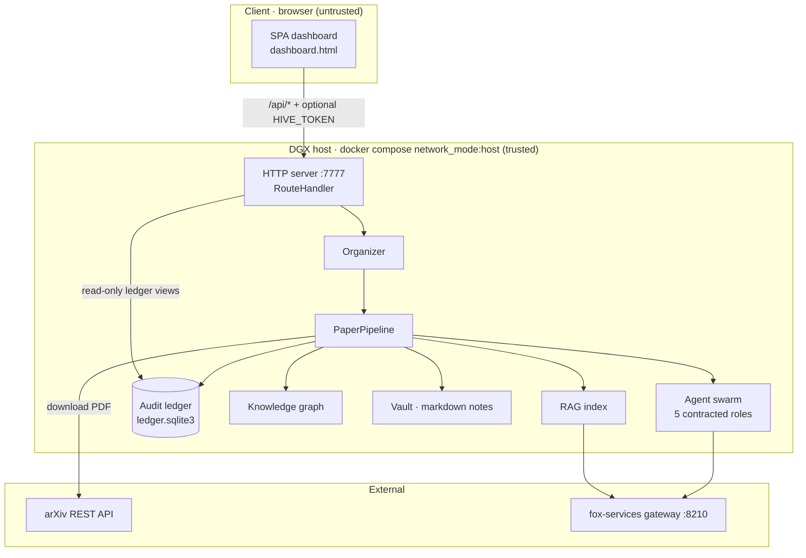
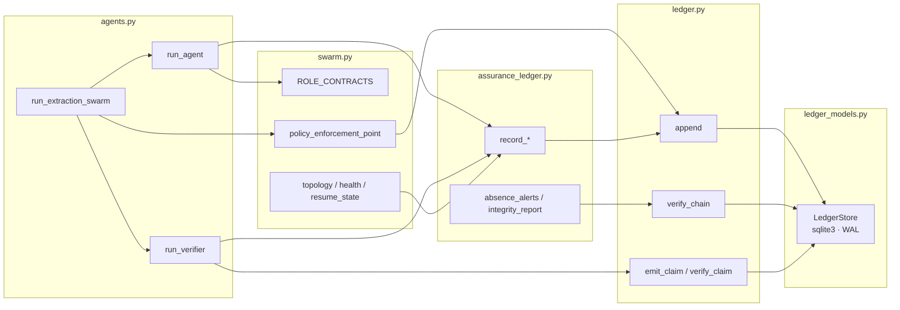
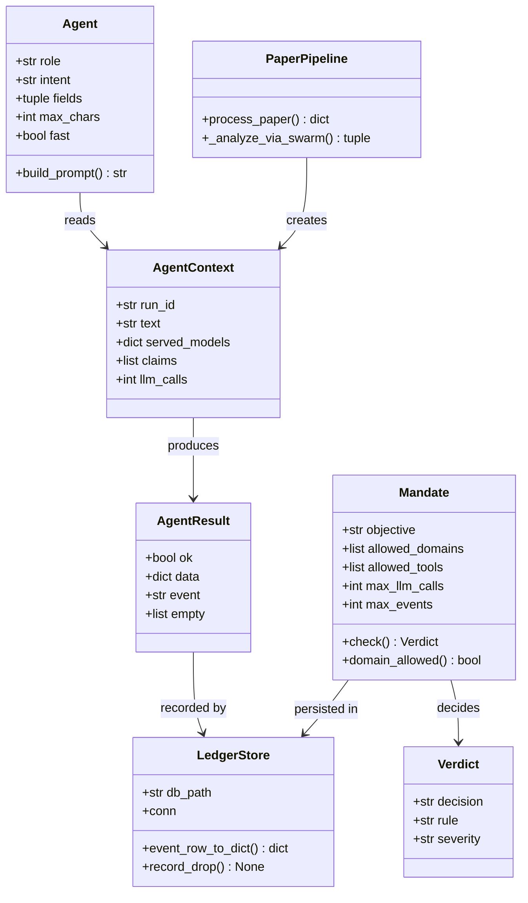
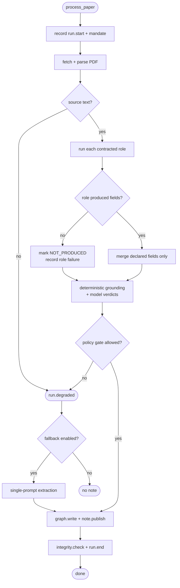
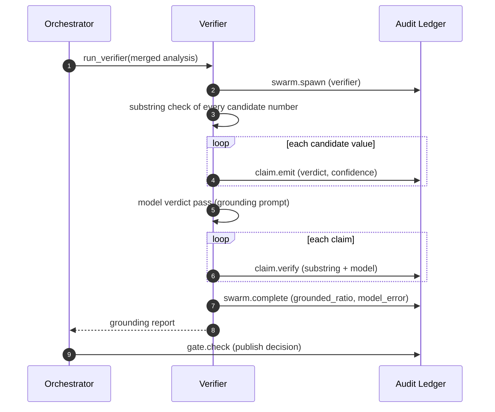
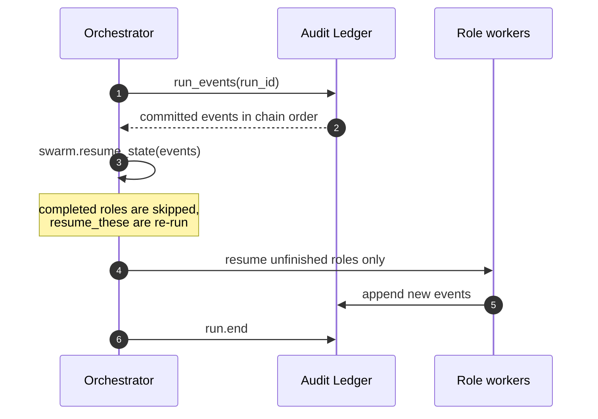
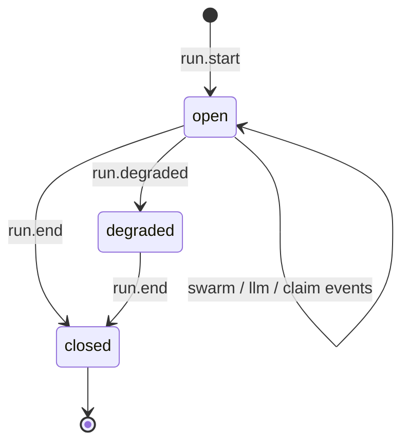
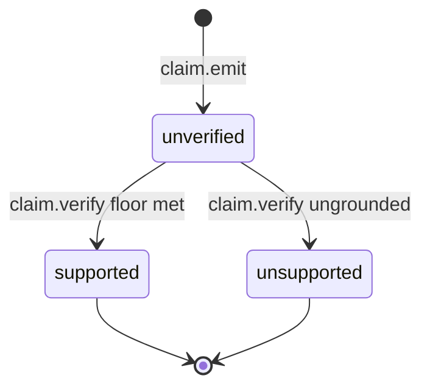
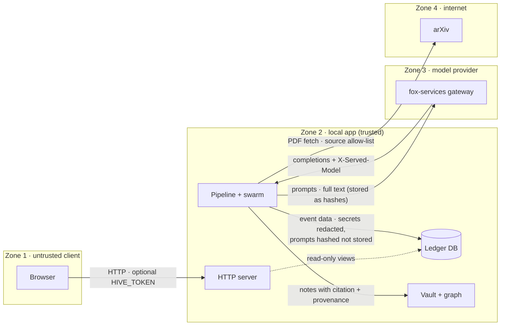
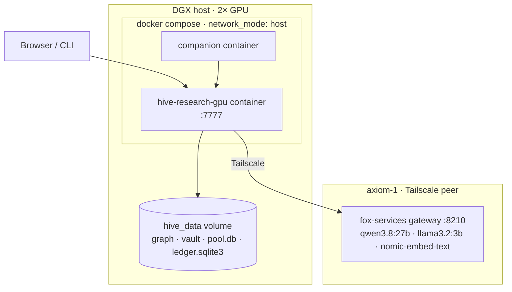

# Design

Detailed diagrams for the subsystems added around the ingest swarm and the audit
ledger. Every diagram is Mermaid source, rendered live in the dashboard's
**About → Documentation** tab and on GitHub.

Each section states the question its diagram answers; together they cover
structure (UML), behaviour (activity, interaction, state), deployment, and the
trust boundaries the system enforces.

## 1. Architecture — containers

*What is in the box, and what talks to what.*

## 2. UML — component dependencies

*Which module owns which responsibility, and how they depend.*

## 3. UML — class model

*The types an ingest is built from.*

## 4. Activity — one ingest

*What decisions the orchestrator makes, and where it can degrade.*

## 5. Interaction — verification

*How a number becomes a claim with a verdict, and what is on the chain.*

## 6. Interaction — resume from the ledger

*How a restarted process rebuilds state without re-running committed roles.*

## 7. State — run and claim lifecycles

*How a run and a claim move through states.*

## 8. Trust boundaries

*What crosses each boundary, and what protects it.*

Boundary controls, in one place:

| Boundary | Data that crosses | Control |
|----------|-------------------|---------|
| Browser → HTTP server | API requests, query params | Optional `HIVE_TOKEN`; path confinement (`_resolve_confined`) |
| Server → Ledger DB | Read-only run/event/claim views | No write path from GET routes |
| Pipeline → arXiv | arXiv ID, PDF request | `swarm_allowed_sources` allow-list |
| Pipeline → Gateway | Paper text, prompts | Redaction in ledger; prompts recorded as hashes (`LEDGER_CAPTURE_PAYLOADS` off) |
| Gateway → Pipeline | Completions, `X-Served-Model` | Requested vs served model both recorded |
| Pipeline → Vault/graph | Note markdown, graph edges | Provenance + confidence in frontmatter |

## 9. Deployment

*Where the pieces run.*

